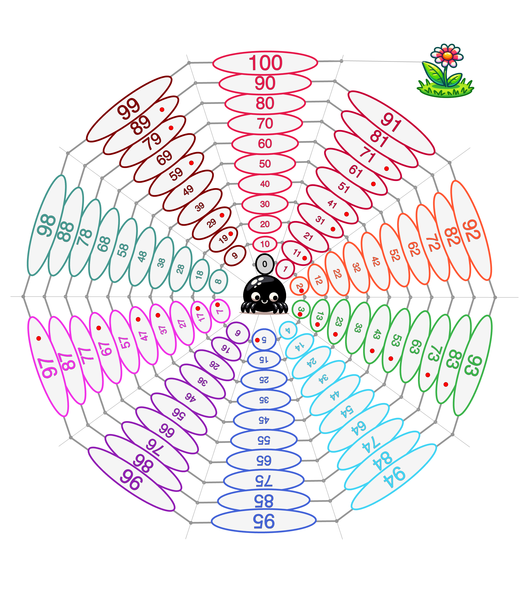

# NumberForChilds

This project constructs a specific list of numbers from 0 to 100 in order to familiarize young children with them.
several scenarios are described below and many others can be imagined.

## simple vocal enumeration 

A 3 year likes to name the numbers one by one, following the spider's web with her finger, proud to climb.     

## A race between children

This race is played with a a six-sided dice and some pawns, one per player.

Starting at 0 on the spider, each child throw the dice and move forward as many boxes, can name the start, the value of the dice and the value of the arrival box.  

### Bonus box  

Some box have a red point ( ***prime numbers***)  which allows player to replay immediately if he arrives on. 

### end of race 

The game runs until every child has reached 100 and leave the web to reach the garden.  

## race with magic digit 

Each player can choose his favorite digit from 1 to 9.  Each time he goes to a box that ends by his digit, he can do a jump onto the next level of this digit (+10).   
To insure equivalence of digits, if the destination box has also a red point, he's not allowed to play again as from a standard access.   
( If you look at web, prime numbers are mainly ended by digit 1,3,7 and 9)   

## the spider against the ladybirds 

One player is the spider , the others ladybirds.   
Ladybirds will play three times before spider starts.   
Every player throw a dice to advance on web but this time is allowed to go forward or backward at their choice:   
- The ladybirds mainly forward to get out of web but sometime backward if the count will fall on the spider box which can be in front.  
- The spider forward to catch ladybird or backward if it has passed some. 
If spider catch ladybird, the game is over for it.    
This game is a kind of introduction to the substraction.    

# Running the app to reconstruct or adapt the game board image 
A script (tested on mac) **py.command** launch a micro server **server.py** and run a chrome brower onto **http://localhost:8081/sketches**    
One can start by himself the server by **python3 server.py** then go to the url  **http://localhost:8081/sketches** with his prefered browser. 

